# 🛍️ Fashion Store

**Fashion Store** is a fully responsive and visually engaging fashion e-commerce website, built entirely using **HTML**, **CSS**, and **JavaScript**. It offers an elegant front-end experience with stylish animations, background videos, and dedicated pages for men, women, and contact.

---

## 🌟 Features

- ✨ Animated homepage with video backgrounds
- 👕 Dedicated product page for Men
- 👗 Dedicated product page for Women
- 📬 Contact page with embedded background video
- 🎥 Background videos on all hero and footer sections
- 📸 High-quality product images
- 🔥 Custom page-specific JS and CSS files
- 📱 Responsive layout (works across devices)

---

## 🧠 Technologies Used

- HTML5
- CSS3
- JavaScript (Vanilla)
- Render for deployment

---

## 📁 Project Structure

```
📦 root/
├── index.html              # Home Page
├── men.html                # Men Page
├── women.html              # Women Page
├── Contact.html            # Contact Page
├── images/                 # Product images for display
├── videos/                 # MP4 video files for hero/footer
├── static/
│   ├── css/                # Separate CSS files for each page
│   ├── js/                 # Separate JS files for each page
│   └── images-2/           # Screenshots used in README
```

---

## 🖼️ Screenshots

### 🏠 Home Page
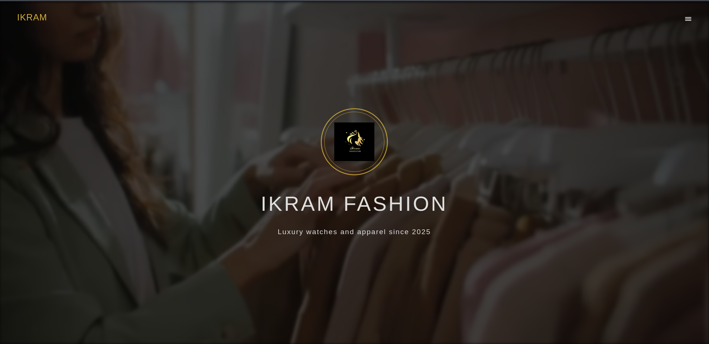  
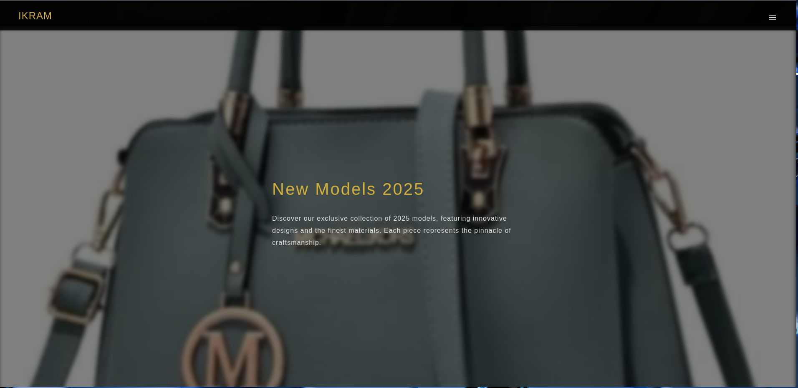  
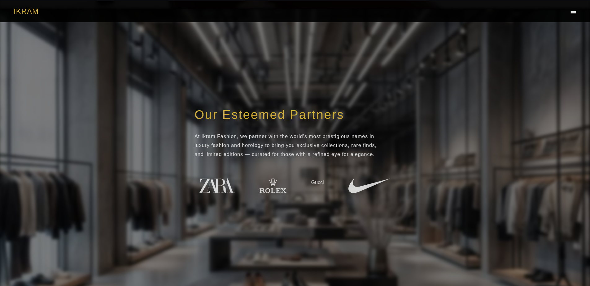  
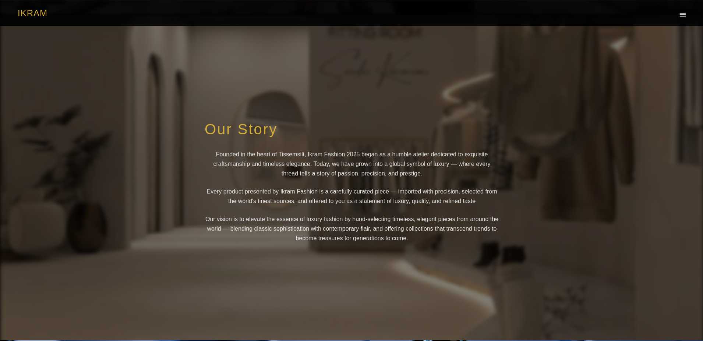

---

### 👕 Men Page
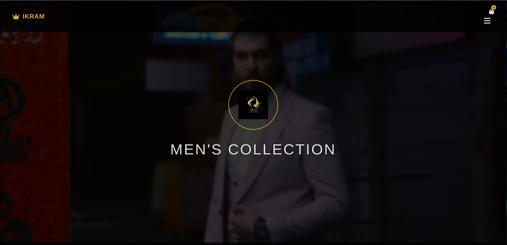  
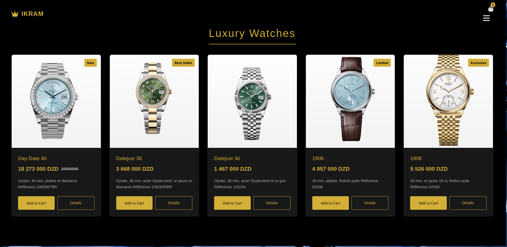  
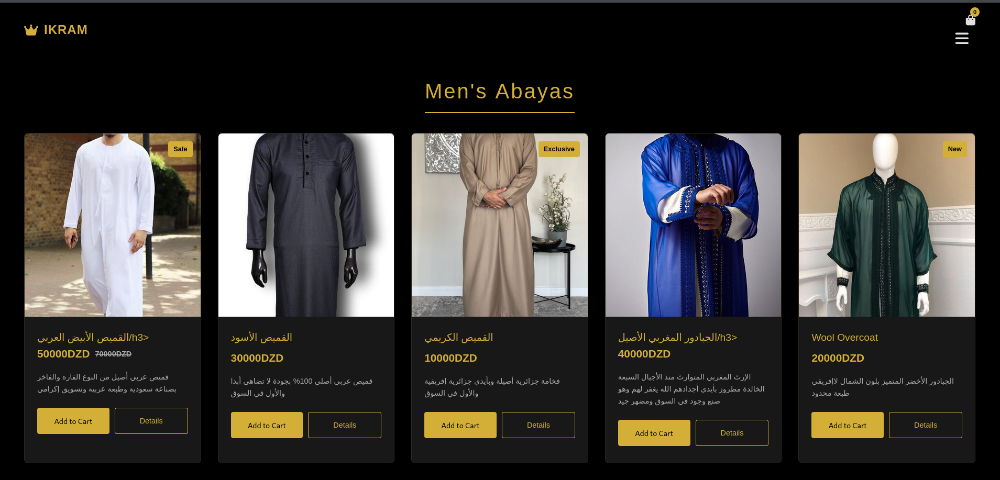  
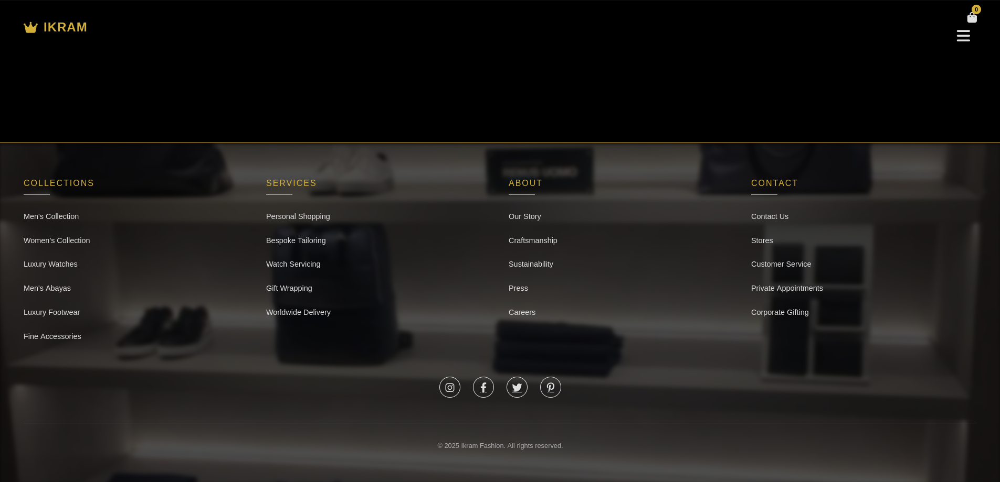

---

### 👗 Women Page
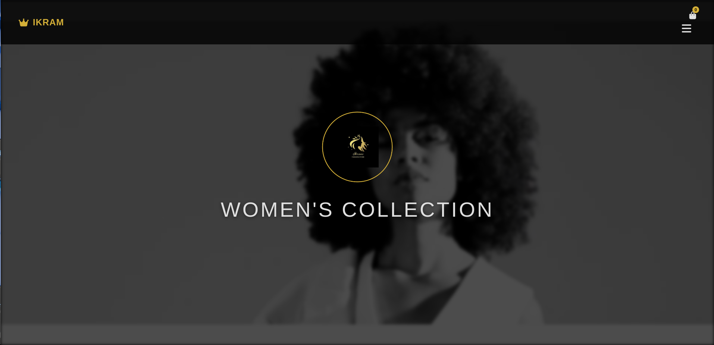  
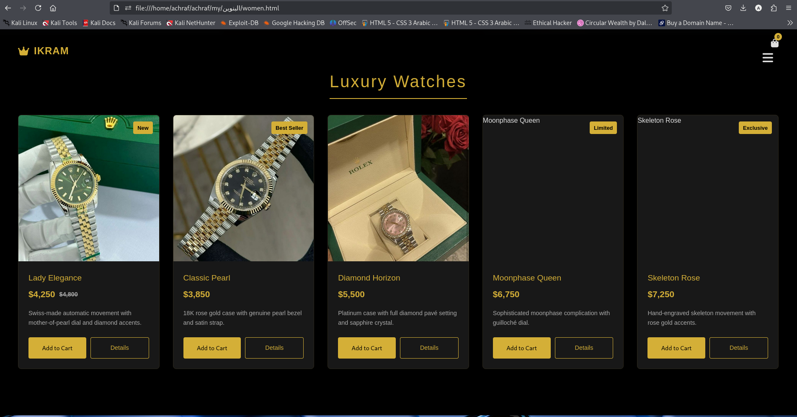  
  
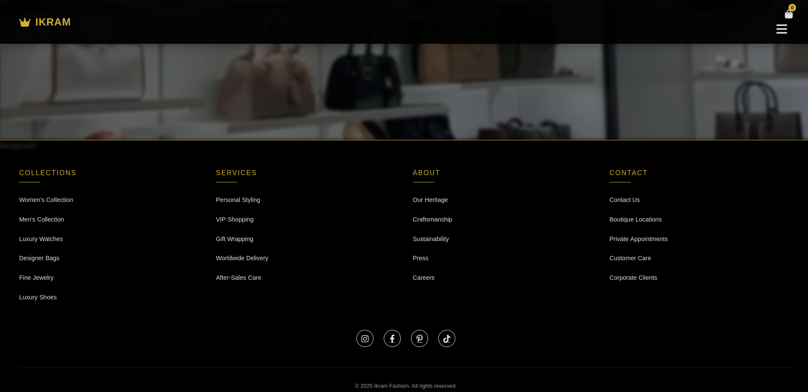

---

### 📞 Contact Page
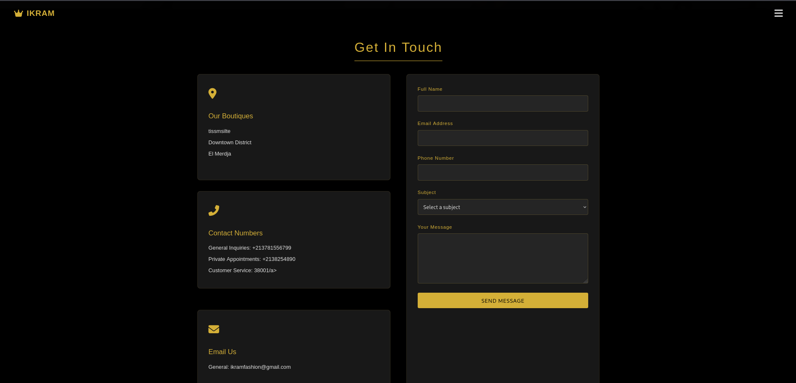

---

## 🚀 How to Run Locally

1. Clone the repository:
   ```bash
   git clone https://github.com/your-username/fashion-store.git
   ```

2. Navigate to the project directory:
   ```bash
   cd fashion-store
   ```

3. Open the project in your browser:
   ```bash
   start index.html     # For Windows
   open index.html      # For macOS
   xdg-open index.html  # For Linux
   ```

⚠️ No server setup or build tools needed. Just open `index.html` and explore.

---

## 🌐 Live Demo

🖥️ [View Live Website](https://fashioen-store.onrender.com)

---

## 📜 License

This project is licensed under the [MIT License](LICENSE).

---

## 🙌 Author

Crafted with 💖 by **Achraf**
